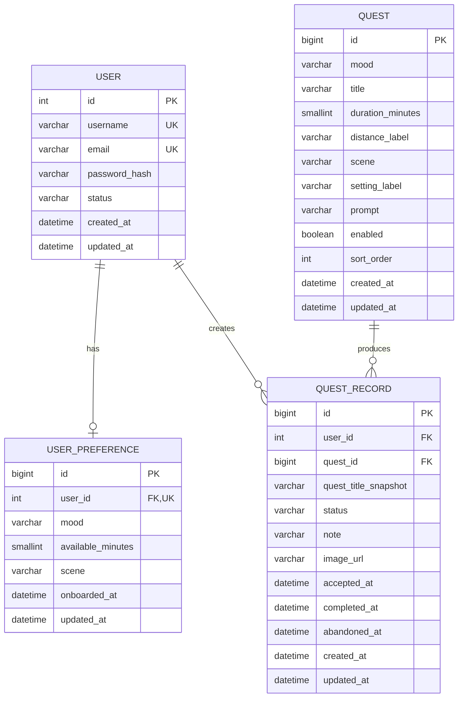

# nestjs-h5 第一期后端接口与数据库设计

> 分析对象：`D:\MyProject\nestProject\nestjs-h5`（Vue 3 + Pinia + Vue Router）  
> 后端项目：`D:\MyProject\nestProject\nestjs-demo`（NestJS 11 + TypeORM + MySQL）

## 1. 先说结论

第一期核心业务需要 **4 张表**：

1. `user`：用户账号，当前后端已经存在。
2. `user_preference`：用户引导页选择的心情、可用时间、场景。
3. `quest`：支线任务库。
4. `quest_record`：用户接受、放弃、完成支线以及纪念文字、图片。

因此，在当前 `nestjs-demo` 的基础上，真正需要为 H5 **新增 3 张业务表**：

- `user_preference`
- `quest`
- `quest_record`

当前项目里的 `logs`、`roles`、`user_roles` 属于日志或权限基础设施，不算 H5 第一期核心业务表。现有 `profile` 的 `gender/photo/address` 与 H5 页面无关，建议暂时不要用它承载业务偏好；学习项目可以先保留，后续确认无数据后再删除。

一期不需要创建以下表：

- 图片表：`quest_record.image_url` 足够，图片文件放本地目录或对象存储。
- 纪念卡表：纪念卡就是一条已完成的 `quest_record`。
- 推荐记录表：当前没有推荐算法分析需求。
- 心情字典、场景字典表：选项固定且很少，用枚举即可。
- Refresh Token 表：一期先使用简单 JWT；正式生产再增加刷新令牌机制。

## 2. 前端现有页面与交互

### 2.1 登录/注册 `/login`

前端已有：

- 用户名或邮箱 + 密码登录。
- “记住我”。
- 注册用户名、邮箱、密码。
- 登录账号不存在时自动切换到注册表单。
- 忘记密码、隐私政策、服务条款目前只是空链接。

需要接口：

- `POST /api/v1/user/register`
- `POST /api/v1/user/login`
- `GET /api/v1/me`

一期暂不提供忘记密码接口，因为按钮当前没有实际流程。真正做找回密码时，至少还需要邮件发送能力和 `password_reset_token` 表。

### 2.2 今日支线 `/today`

前端已有：

- 首次使用引导。
- 选择心情：松弛、新鲜、成就感、陪伴。
- 选择可用时间：5 分钟、20 分钟、1 小时。
- 选择场景：室内、室外、都可以。
- 查看推荐支线。
- 切换心情、换一个推荐。
- 接受、放弃、完成支线。
- 完成时填写一句话和选择图片。
- 生成纪念卡并分享。

需要接口：

- `PUT /api/v1/me/preference`
- `GET /api/v1/quests/recommendation`
- `POST /api/v1/quest-records`
- `GET /api/v1/quest-records/active`
- `PATCH /api/v1/quest-records/:id/abandon`
- `POST /api/v1/quest-records/:id/complete`

建议访问规则：未登录用户可以查看推荐；点击“接受支线”时要求登录。这样数据库中的记录一定属于明确用户，避免设计匿名用户、游客 token 和登录后数据合并。

### 2.3 探索 `/explore`

前端会展示所有支线，点击某项后切换对应心情并进入今日页。

需要接口：

- `GET /api/v1/quests`

### 2.4 记录 `/records`

前端展示已完成支线的日期、标题、文字和图片，路由已经要求登录。

需要接口：

- `GET /api/v1/quest-records?status=completed&page=1&pageSize=10`

### 2.5 我的世界 `/profile`

前端展示：

- 已完成支线数量。
- 偏好心情。
- 常用时间。
- 行动场景。
- 重新设置偏好。

需要接口：

- `GET /api/v1/me`
- `PUT /api/v1/me/preference`

“重新设置”不必真的删除偏好，只需把前端引导页重新打开，用户提交新选项时覆盖原记录。

## 3. 当前联调前必须修复的问题

### 3.1 响应结构不一致

后端 `ResponseInterceptor` 返回：

```json
{
  "code": "SUCCESS",
  "success": true,
  "message": "操作成功",
  "data": {
    "accessToken": "..."
  }
}
```

但前端 `src/api/auth.ts` 把 Axios 的 `response.data` 直接当成登录结果，实际取到的是整个包装对象。因此：

```ts
result.accessToken // undefined
result.user        // undefined
```

建议在前端提供统一请求函数：

```ts
export interface ApiResponse<T> {
  code: string
  success: boolean
  message: string
  data: T
}

export async function request<T>(config: AxiosRequestConfig) {
  const response = await http.request<ApiResponse<T>>(config)
  return response.data.data
}
```

然后登录接口写成：

```ts
export const login = (data: LoginPayload) =>
  request<LoginResponse>({ method: 'POST', url: '/v1/user/login', data })
```

### 3.2 缺少 JWT 身份校验

当前后端可以签发 JWT，但没有 Guard 验证 JWT。后续的偏好和记录接口不能接受前端传来的 `userId`，否则任何人都可以修改其他用户的数据。

正确流程是：

1. 前端发送 `Authorization: Bearer <token>`。
2. Guard 验证 token。
3. 从 token 的 `sub` 获取当前用户 ID。
4. Service 只操作这个用户的数据。

使用现有 `JwtService.verifyAsync()` 就够了，一期不必为了它增加 Passport 依赖。

### 3.3 用户状态没有在刷新后恢复

前端只把 token 存入 `localStorage`，Pinia 中的 `user` 刷新后会变回 `null`。应用启动时应在存在 token 的情况下调用 `GET /me`。

### 3.4 401 没有统一处理

Axios 响应拦截器应在 401 时删除 token，并跳转登录页。否则过期 token 会一直留在浏览器里。

### 3.5 “记住我”目前没有真正生效

后端无论选择与否都签发 15 分钟 token，前端也始终写入 `localStorage`。一期有两个选择：

- 最简单：暂时删除“记住我”，统一 2 小时过期。
- 保留交互：勾选时 token 7 天有效并存 `localStorage`；未勾选时 2 小时有效并存 `sessionStorage`。

正式系统更推荐短 access token + 可撤销的 refresh token，但这会增加一张 token 表和更多安全逻辑，不属于当前一期必需。

### 3.6 图片不能继续存 Base64 到 localStorage

当前 `FileReader.readAsDataURL()` 会把整张图片塞进 Pinia 和 localStorage。浏览器 localStorage 一般只有数 MB，几张手机照片就可能写满。

完成接口应使用 `multipart/form-data` 上传文件；数据库只保存文件 URL。

### 3.7 当前“换一个”实际换不了

静态数据中每种心情只有一条支线，过滤后数组长度是 1，因此点击“换一个”仍然是原任务。数据库初始化时建议每种心情至少准备 3 条支线。

### 3.8 问候语用户名写死

今日页的“林一”应来自 `GET /me` 返回的 `username` 或昵称。

## 4. 数据库设计

关系如下：



### 4.1 `user_preference`

| 字段 | 类型 | 约束 | 说明 |
|---|---|---|---|
| `id` | bigint unsigned | PK, auto increment | 主键 |
| `user_id` | int | FK, UNIQUE, NOT NULL | 一个用户只有一份偏好 |
| `mood` | varchar(20) | NOT NULL | `relaxed/fresh/achievement/company` |
| `available_minutes` | smallint unsigned | NOT NULL | 5、20、60 |
| `scene` | varchar(20) | NOT NULL | `indoor/outdoor/any` |
| `onboarded_at` | datetime | NOT NULL | 首次完成引导时间 |
| `created_at` | datetime | NOT NULL | 创建时间 |
| `updated_at` | datetime | NOT NULL | 更新时间 |

数据库存稳定英文枚举，接口向前端也返回英文 code；中文“松弛”等属于展示文案，放在前端映射。这样以后改中文文案不会迁移数据库。

### 4.2 `quest`

| 字段 | 类型 | 约束 | 说明 |
|---|---|---|---|
| `id` | bigint unsigned | PK | 支线 ID |
| `mood` | varchar(20) | INDEX, NOT NULL | 适合的心情 |
| `title` | varchar(120) | NOT NULL | 标题，可包含换行 |
| `duration_minutes` | smallint unsigned | INDEX, NOT NULL | 用于时间过滤 |
| `distance_label` | varchar(30) | NOT NULL | 例如“600米”“附近” |
| `scene` | varchar(20) | INDEX, NOT NULL | `indoor/outdoor/any/online` |
| `setting_label` | varchar(30) | NOT NULL | 例如“适合独自”“可结伴” |
| `prompt` | varchar(300) | NOT NULL | 引导文字 |
| `enabled` | boolean | INDEX, default true | 软下架，不直接删除历史任务 |
| `sort_order` | int | default 0 | 探索页排序 |
| `created_at` | datetime | NOT NULL | 创建时间 |
| `updated_at` | datetime | NOT NULL | 更新时间 |

### 4.3 `quest_record`

| 字段 | 类型 | 约束 | 说明 |
|---|---|---|---|
| `id` | bigint unsigned | PK | 记录 ID |
| `user_id` | int | FK, INDEX, NOT NULL | 当前用户 |
| `quest_id` | bigint unsigned | FK, INDEX, NOT NULL | 原始支线 |
| `quest_title_snapshot` | varchar(120) | NOT NULL | 接受时复制标题，避免后来改任务导致历史记录变化 |
| `status` | varchar(20) | INDEX, NOT NULL | `accepted/completed/abandoned` |
| `note` | varchar(500) | NULL | 完成感想 |
| `image_url` | varchar(500) | NULL | 图片 URL，不存 Base64 |
| `accepted_at` | datetime | NOT NULL | 接受时间 |
| `completed_at` | datetime | NULL | 完成时间 |
| `abandoned_at` | datetime | NULL | 放弃时间 |
| `created_at` | datetime | NOT NULL | 创建时间 |
| `updated_at` | datetime | NOT NULL | 更新时间 |

建议建立联合索引：

```sql
CREATE INDEX idx_record_user_status_created
ON quest_record (user_id, status, created_at);
```

它正好服务“查当前进行中任务”和“分页查已完成记录”两个高频查询。

## 5. 接口约定

### 5.1 通用成功响应

```json
{
  "code": "SUCCESS",
  "success": true,
  "message": "操作成功",
  "data": {}
}
```

### 5.2 通用失败响应

```json
{
  "code": "VALIDATION_ERROR",
  "success": false,
  "message": "请求参数不正确",
  "data": null,
  "errors": [
    { "field": "availableMinutes", "message": "可用时间必须是 5、20 或 60" }
  ]
}
```

建议 HTTP 状态码保留真实含义：400 参数错误、401 未登录或 token 失效、404 数据不存在、409 状态冲突、500 服务端异常。不要所有响应都返回 200。

## 6. 详细接口清单

### 6.1 注册

`POST /api/v1/user/register`，公开接口。

请求：

```json
{
  "username": "linyi",
  "email": "linyi@example.com",
  "password": "12345678"
}
```

响应 `data`：

```json
{
  "id": 1,
  "username": "linyi",
  "email": "linyi@example.com"
}
```

### 6.2 登录

`POST /api/v1/user/login`，公开接口。

请求：

```json
{
  "account": "linyi@example.com",
  "password": "12345678",
  "rememberMe": true
}
```

响应 `data`：

```json
{
  "accessToken": "eyJ...",
  "expiresIn": 604800,
  "user": {
    "id": 1,
    "username": "linyi",
    "email": "linyi@example.com",
    "lastLoginAt": "2026-08-13T10:00:00.000Z"
  }
}
```

安全建议：账号不存在和密码错误都返回 401 + “账号或密码错误”，不要用 404 暴露某邮箱是否已经注册。前端也不要再依赖 404 自动进入注册页。

### 6.3 当前用户主页数据

`GET /api/v1/me`，需要登录。

响应 `data`：

```json
{
  "id": 1,
  "username": "linyi",
  "email": "linyi@example.com",
  "preference": {
    "mood": "fresh",
    "availableMinutes": 20,
    "scene": "any",
    "onboarded": true
  },
  "stats": {
    "completedQuestCount": 3
  }
}
```

把用户、偏好和完成数量一次返回，可以让 Profile 页面只发一个请求。

### 6.4 保存偏好

`PUT /api/v1/me/preference`，需要登录。使用 PUT 是因为整份偏好被一次完整替换，重复提交结果一致。

请求：

```json
{
  "mood": "fresh",
  "availableMinutes": 20,
  "scene": "any"
}
```

响应 `data` 与请求相同，额外返回 `onboardedAt`。

### 6.5 探索支线列表

`GET /api/v1/quests?mood=fresh&scene=outdoor&maxMinutes=20&page=1&pageSize=20`，公开接口。

所有查询参数都可选。只返回 `enabled = true` 的支线。

响应 `data`：

```json
{
  "items": [
    {
      "id": 1,
      "mood": "fresh",
      "title": "去一条没走过的街，\n拍下三个蓝色物件",
      "durationMinutes": 20,
      "durationLabel": "约20分钟",
      "distanceLabel": "600米",
      "scene": "outdoor",
      "settingLabel": "适合独自",
      "prompt": "不用走得很远，只要离开熟悉的路线一小会儿。"
    }
  ],
  "page": 1,
  "pageSize": 20,
  "total": 12
}
```

### 6.6 获取今日推荐/换一个

`GET /api/v1/quests/recommendation?mood=fresh&scene=any&maxMinutes=20&excludeId=1`，公开接口。

- 初次推荐不传 `excludeId`。
- 点击“换一个”时传当前支线 ID。
- 后端优先严格匹配；无结果时可以忽略 scene 再查；仍无结果则只按 mood 查询。
- 小数据量可用 `ORDER BY RAND()`；支线达到数万条后再换随机 ID 算法。

响应 `data` 是单个 Quest。完全没有可用支线时返回 404 和 `QUEST_NOT_FOUND`。

### 6.7 接受支线

`POST /api/v1/quest-records`，需要登录。

请求：

```json
{ "questId": 1 }
```

响应 `data`：

```json
{
  "id": 1001,
  "status": "accepted",
  "acceptedAt": "2026-08-13T10:10:00.000Z",
  "quest": {
    "id": 1,
    "title": "去一条没走过的街，\n拍下三个蓝色物件"
  }
}
```

一期规定每个用户同时只能有一条 `accepted` 记录。已有进行中支线时再次接受返回 409：

```json
{
  "code": "ACTIVE_QUEST_EXISTS",
  "success": false,
  "message": "你已有一条进行中的支线",
  "data": null
}
```

### 6.8 获取进行中的支线

`GET /api/v1/quest-records/active`，需要登录。

- 有进行中记录：返回 QuestRecord。
- 没有进行中记录：成功响应，`data: null`。

不建议用 404 表示“当前没有任务”，因为这是正常业务状态。

### 6.9 放弃支线

`PATCH /api/v1/quest-records/:id/abandon`，需要登录，无请求体。

只有记录所属用户且状态为 `accepted` 才能放弃。重复完成或放弃返回 409 `QUEST_RECORD_STATE_INVALID`。

### 6.10 完成支线

`POST /api/v1/quest-records/:id/complete`，需要登录，Content-Type 为 `multipart/form-data`。

字段：

- `note`：可选，最多 500 字。
- `image`：可选，仅 jpg/png/webp，建议最大 5 MB。

响应 `data`：

```json
{
  "id": 1001,
  "status": "completed",
  "questTitle": "去一条没走过的街，拍下三个蓝色物件",
  "note": "今天的城市，比平时多了一点蓝色。",
  "imageUrl": "/uploads/quests/4f0c....webp",
  "completedAt": "2026-08-13T11:00:00.000Z"
}
```

图片保存成功但数据库更新失败时要删除刚保存的文件，避免产生孤儿文件。生产环境建议改为对象存储，接口返回 CDN URL。

### 6.11 完成记录列表

`GET /api/v1/quest-records?status=completed&page=1&pageSize=10`，需要登录。

响应 `data`：

```json
{
  "items": [
    {
      "id": 1001,
      "questTitle": "去一条没走过的街，拍下三个蓝色物件",
      "note": "今天的城市，比平时多了一点蓝色。",
      "imageUrl": "/uploads/quests/4f0c....webp",
      "completedAt": "2026-08-13T11:00:00.000Z"
    }
  ],
  "page": 1,
  "pageSize": 10,
  "total": 3
}
```

前端显示日期时再使用 `Intl.DateTimeFormat('zh-CN')` 格式化。数据库和接口统一保存/返回完整时间，不保存“8月13日”这种展示字符串。

### 6.12 分享纪念卡

一期不需要后端接口。前端优先调用 `navigator.share()`，不支持时下载图片或复制链接。只有未来需要公开分享页、分享链接失效时间和访问统计时，才增加分享表与接口。

## 7. NestJS 实现结构

建议新增以下最少文件：

```text
src/
├─ auth/
│  ├─ jwt-auth.guard.ts
│  └─ current-user.decorator.ts
├─ me/
│  ├─ dto/update-preference.dto.ts
│  ├─ user-preference.entity.ts
│  ├─ me.controller.ts
│  ├─ me.service.ts
│  └─ me.module.ts
├─ quest/
│  ├─ dto/query-quest.dto.ts
│  ├─ quest.entity.ts
│  ├─ quest.controller.ts
│  ├─ quest.service.ts
│  └─ quest.module.ts
└─ quest-record/
   ├─ dto/create-quest-record.dto.ts
   ├─ dto/complete-quest-record.dto.ts
   ├─ quest-record.entity.ts
   ├─ quest-record.controller.ts
   ├─ quest-record.service.ts
   └─ quest-record.module.ts
```

不需要先创建 Repository 层。TypeORM Repository 已经是数据访问层，Service 直接使用即可。

### 7.1 枚举

```ts
export enum Mood {
  RELAXED = 'relaxed',
  FRESH = 'fresh',
  ACHIEVEMENT = 'achievement',
  COMPANY = 'company',
}

export enum Scene {
  INDOOR = 'indoor',
  OUTDOOR = 'outdoor',
  ANY = 'any',
  ONLINE = 'online',
}

export enum QuestRecordStatus {
  ACCEPTED = 'accepted',
  COMPLETED = 'completed',
  ABANDONED = 'abandoned',
}
```

### 7.2 偏好 DTO

```ts
export class UpdatePreferenceDto {
  @IsEnum(Mood)
  mood!: Mood;

  @IsIn([5, 20, 60])
  availableMinutes!: number;

  @IsEnum(Scene)
  scene!: Scene;
}
```

全局 `ValidationPipe` 已有 `transform` 和 `whitelist`，再建议开启：

```ts
new ValidationPipe({
  transform: true,
  whitelist: true,
  forbidNonWhitelisted: true,
})
```

### 7.3 JWT Guard 的核心逻辑

```ts
@Injectable()
export class JwtAuthGuard implements CanActivate {
  constructor(private readonly jwtService: JwtService) {}

  async canActivate(context: ExecutionContext) {
    const request = context.switchToHttp().getRequest<AuthRequest>();
    const [type, token] = request.headers.authorization?.split(' ') ?? [];
    if (type !== 'Bearer' || !token) throw new UnauthorizedException();

    try {
      request.user = await this.jwtService.verifyAsync<{ sub: number; username: string }>(token);
      return true;
    } catch {
      throw new UnauthorizedException('登录状态已过期');
    }
  }
}
```

控制器通过 `@CurrentUser('sub') userId: number` 获取用户 ID。DTO 中不要设计 `userId`。

### 7.4 保存偏好使用 upsert

第一次提交创建，之后覆盖：

```ts
const existing = await this.preferenceRepository.findOneBy({ userId });
return this.preferenceRepository.save(
  this.preferenceRepository.create({
    ...existing,
    userId,
    ...dto,
    onboardedAt: existing?.onboardedAt ?? new Date(),
  }),
);
```

### 7.5 推荐查询

```ts
const qb = this.questRepository
  .createQueryBuilder('quest')
  .where('quest.enabled = :enabled', { enabled: true })
  .andWhere('quest.mood = :mood', { mood: query.mood })
  .andWhere('quest.durationMinutes <= :maxMinutes', {
    maxMinutes: query.maxMinutes,
  });

if (query.scene !== Scene.ANY) {
  qb.andWhere('quest.scene IN (:...scenes)', {
    scenes: [query.scene, Scene.ANY],
  });
}
if (query.excludeId) {
  qb.andWhere('quest.id != :excludeId', { excludeId: query.excludeId });
}

return qb.orderBy('RAND()').getOne();
```

先实现严格查询即可；“无结果时逐步放宽条件”放在 Service 内调用两三次小查询，不需要推荐策略类或规则引擎。

### 7.6 接受支线

Service 的处理顺序：

1. 查询支线是否存在且已启用。
2. 查询用户是否已有 `accepted` 记录。
3. 有则抛出 `ConflictException`。
4. 创建记录，同时复制 `quest.title` 到 `questTitleSnapshot`。

并发量很小时，上述逻辑足够学习和一期使用。正式开放高并发后，需要用事务或额外的“当前任务”唯一约束避免用户同时点击两次产生两条进行中记录。

### 7.7 完成/放弃必须限制状态

查询条件必须同时带上 `id`、`userId` 和 `status = accepted`：

```ts
const record = await this.recordRepository.findOneBy({
  id,
  userId,
  status: QuestRecordStatus.ACCEPTED,
});
```

这样既防越权，也防止已完成记录被重复修改。

### 7.8 数据库迁移与种子数据

开发环境当前 `synchronize: true` 能自动建表，但它不适合生产。建议学习顺序：

1. 先用 Entity + `synchronize: true` 在本地理解表结构。
2. 结构稳定后改成 `synchronize: false`。
3. 使用 TypeORM migration 创建和升级表。
4. 写一个 seed 脚本，为四种心情各插入至少 3 条支线。

不要每次启动服务都无条件插入种子数据；可以按唯一标题检查后插入，或把 seed 作为单独 npm script。

## 8. 前端需要修改的文件

建议新增：

```text
src/api/me.ts
src/api/quest.ts
src/api/quest-record.ts
src/types/api.ts
```

建议修改：

- `src/api/http.ts`：统一解包、401 清 token。
- `src/api/auth.ts`：改用统一 `request<T>`。
- `src/stores/auth.ts`：增加 `loadMe()`、`signOut()`，正确处理 rememberMe。
- `src/stores/journey.ts`：移除静态 `quests` 和 records 的 localStorage 持久化，改调 API。
- `src/views/TodayView.vue`：引导保存偏好；推荐、接受、放弃、完成调接口。
- `src/views/ExploreView.vue`：加载支线列表。
- `src/views/RecordsView.vue`：分页加载完成记录。
- `src/views/ProfileView.vue`：使用 `/me` 数据。

### 完成接口的前端请求示例

```ts
export async function completeQuestRecord(id: number, note: string, image?: File) {
  const data = new FormData()
  data.append('note', note)
  if (image) data.append('image', image)

  return request<QuestRecord>({
    method: 'POST',
    url: `/v1/quest-records/${id}/complete`,
    data,
  })
}
```

前端预览仍可使用 `URL.createObjectURL(file)`，但只把原始 `File` 交给接口，不把 Base64 持久化。

## 9. 推荐开发顺序

按下面顺序开发，每一步都能独立验证：

1. 修复前端响应解包，确认注册、登录成功，token 不是 `undefined`。
2. 实现 JwtAuthGuard 和 `/me`，确认伪造/过期 token 返回 401。
3. 创建 `user_preference`，实现读取和覆盖偏好。
4. 创建 `quest`，插入至少 12 条种子数据，实现探索列表和推荐。
5. 创建 `quest_record`，实现接受、查询进行中、放弃。
6. 实现完成接口，先只保存 note，再增加图片上传。
7. 接入 Records 和 Profile。
8. 最后实现 Web Share、空状态、加载状态和错误提示。

## 10. 最小验收清单

- 注册重复用户名/邮箱返回 409。
- 错误密码不能登录，密码不会出现在查询响应中。
- 无 token 不能访问 `/me` 和任何记录写接口。
- 首次引导保存后，换设备登录仍能读取偏好。
- 推荐结果符合心情、时间和场景；换一个不会返回当前 ID。
- 同一用户只能有一条进行中支线。
- 用户不能完成或放弃其他人的记录。
- 完成后 active 返回 null，Records 出现新记录，Profile 数量加 1。
- 图片类型和大小不合法时返回 400。
- 分页只能查到当前用户自己的记录。
- 前端刷新后能根据 token 恢复用户资料。

## 11. 第二期再考虑的能力

- refresh token 与多设备登录管理。
- 忘记密码、邮箱验证。
- 管理端维护支线。
- 公开分享链接。
- 收藏、点赞、评论。
- 推荐曝光/点击/完成率分析。
- OSS/S3 对象存储和图片压缩。
- 根据历史行为做个性化推荐。

这些能力现在都没有对应前端交互，提前建设只会增加表和代码，不建议放进第一期。
